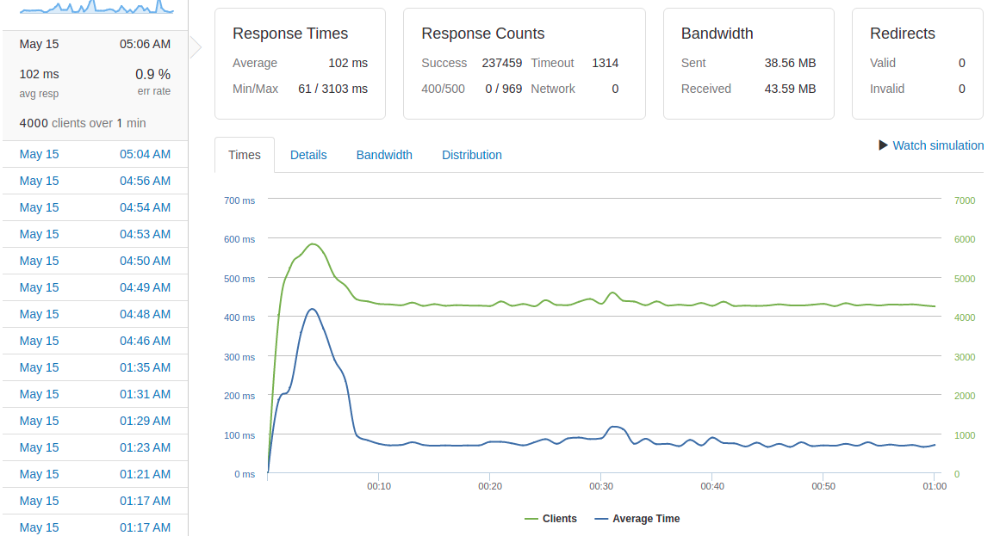

# Atelier - An updated back-end service for Catwalk, a Front-end Retail Web Application
Questions and Answers Service API

Created an extraction, transformation, and loading (ETL) process and migrated 3GB of data stored in CSV format into a PostgreSQL database. The data was stored in three tables each with their own schema (questions, answers, and photos). Optimized joins by assigning foreign keys and indexing them, resulting in query times of less than 1ms.

Deployed three API servers using a Fastify framework to three AWS EC2 t2micro instances. Load stress testing was conducted with Loader.io and load-balancing was managed using pooling in PostgreSQL and the load-balancing tool NGINX, resulting in a throughput of 4000 requests per second, an average response time of less than 100ms and an error rate under 1% for both the questions and answers API routes.

## Tech Stack

- [Node](https://nodejs.org/en/)
- [Fastify](https://www.fastify.io/)
- [PostgreSQL](https://www.postgresql.org/)
- [AWS](https://aws.amazon.com/)
- [NGINX](https://www.nginx.com/)

Questions API:

Answers API:
